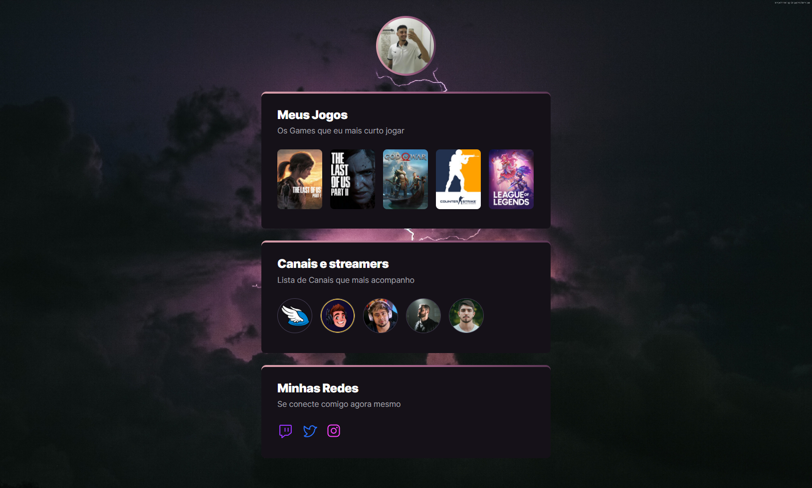

# NLW eSports - Trilha Explorer

Next Level Week

Projeto construído do evento da Rocketseat chamado Next Level Week, com o intuito de desenvolver um Game hub, um site centralizador de links, no estilo Linktree, feito especialmente para gamers utilizarem na Twitch e outras redes sociais, com a proposta de compartilhar quais games e canais acompanham, uma maneira de aprender muito essa semana com um conteudo que gosto muito, que é o universo de Games, agradeço muito pela opotunidade de estar participando da semana, e agregando muito conhecimento.

[🔗 Clique aqui para acessar](https://vtssbr.github.io/NLW/)

## 👨🏻‍💻 Tecnologias

- HTML 
- CSS
- Git e Github

## 📧 Contato

- vitorsouzasilva121@gmail.com 